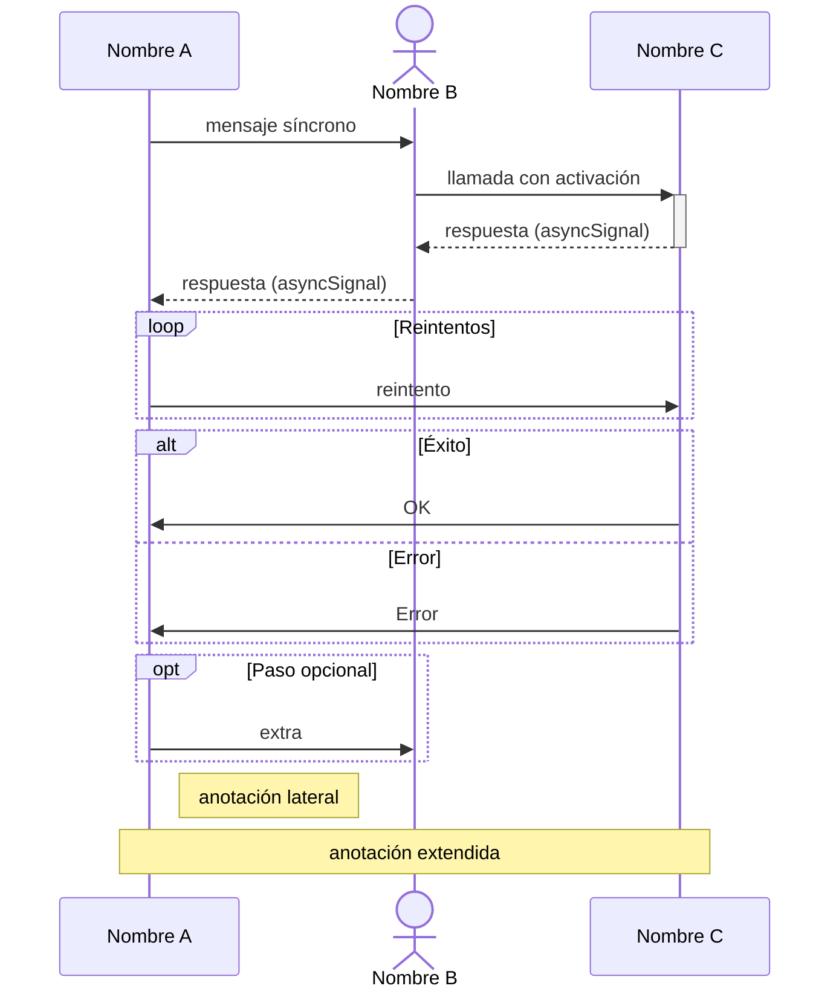

# StarUML — Soporte Mermaid para Diagramas de Secuencia

**Fuente:** [docs.staruml.io/user-guide/mermaid-support](https://docs.staruml.io/user-guide/mermaid-support) (verificada vía Wayback Machine, versión 30/03/2026)
**Versión StarUML mínima:** V7 (7.0.0, lanzada julio 2025)

---

## Cómo generar un diagrama desde Mermaid

1. Menú **Tools → Generate Diagram by Mermaid…**
2. Pegar el código Mermaid en el editor.
3. Hacer clic en **Generate**.
4. Seleccionar el **paquete** donde se contendrán el diagrama y sus elementos.

> La función genera el diagrama UML en el modelo de StarUML. Puede haber diferencias
> de estilo y layout respecto al rendering visual de Mermaid puro.

---

## Elementos soportados en diagramas de secuencia

### Participantes y actores

```mermaid
participant A as Alias
actor B as OtroAlias
create participant C
create actor D as Donald
destroy C
```

### Tipos de flecha (los únicos que funcionan correctamente)

| Sintaxis | Tipo UML en StarUML                |
| -------- | ---------------------------------- |
| `->>`    | Mensaje síncrono (sólido + flecha) |
| `-->>`   | `asyncSignal` (punteado + flecha)  |

> **Importante:** `-->>` se importa como tipo `asyncSignal`, **no** como mensaje de
> respuesta (`reply`) estándar UML. Tenerlo en cuenta al modelar retornos.

### Activaciones

```mermaid
A->>+B: llamada
B-->>-A: respuesta
```

> **Limitación crítica:** StarUML no controla la activación por mensaje individual.
> Si al menos un mensaje usa `+`/`-`, la barra de activación se muestra durante
> **todo el diagrama** para ese participante.

### Bloques combinados (fragments)

```mermaid
loop Descripción
    A->>B: mensaje
end

alt condición verdadera
    A->>B: opción A
else condición falsa
    A->>B: opción B
end

opt Descripción opcional
    A->>B: mensaje
end

par Alice a Bob
    A->>B: en paralelo
and Alice a Carl
    A->>C: en paralelo
end

critical Acción obligatoria
    A->>B: conectar
option Timeout
    A->>A: log error
end

break excepción
    A->>B: fallo crítico
end
```

### Notas

```mermaid
Note right of A: texto
Note left of B: texto
Note over A,B: texto extendido
```

### Numeración automática

```mermaid
autonumber
A->>B: primer mensaje
```

---

## Elementos NO soportados (causan defectos o se ignoran)

| Elemento             | Sintaxis Mermaid        | Motivo                                            |
| -------------------- | ----------------------- | ------------------------------------------------- |
| Group / Box          | `box ... end`           | No existe equivalente en el modelo UML de StarUML |
| Fondo de color       | `rect rgb(...) ... end` | No soportado                                      |
| Estilos y clases     | `%%{init: {...}}%%`     | No soportado                                      |
| Menú de actores      | `link`/`links`          | No soportado                                      |
| Flecha sin punta     | `->`, `-->`             | No existe en la especificación UML                |
| Flecha con cruz      | `-x`, `--x`             | No existe en la especificación UML                |
| Flecha bidireccional | `<<->>`, `<<-->>`       | No existe en la especificación UML                |

---

## Plantilla segura para StarUML

Copiar y adaptar este bloque garantiza importación sin defectos:



---

## Diagramas soportados por StarUML (referencia general)

StarUML V7 admite los siguientes tipos de diagrama vía Mermaid:

- Class Diagram (`classDiagram`)
- Sequence Diagram (`sequenceDiagram`)
- State Diagram (`stateDiagram-v2`)
- Flowchart (`flowchart TD`)
- Entity Relationship Diagram (`erDiagram`)
- Requirement Diagram (`requirementDiagram`)
- Mindmap (`mindmap`)
